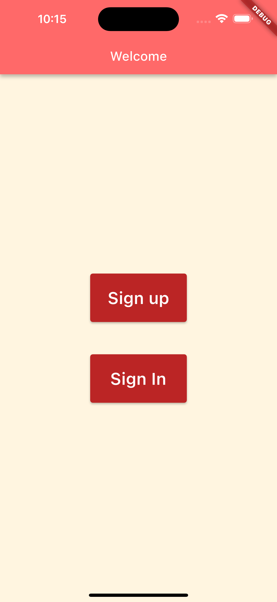
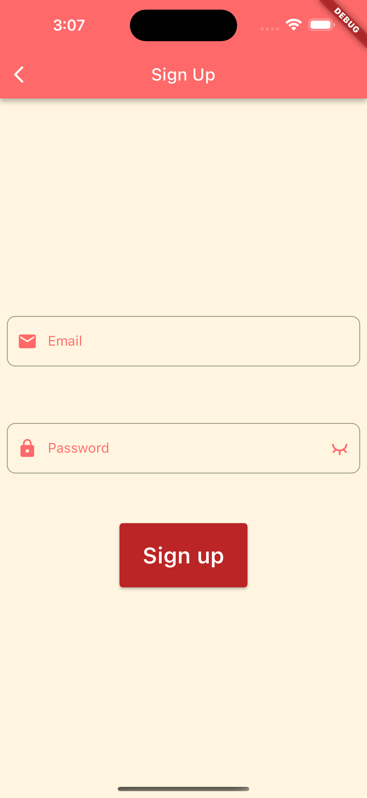
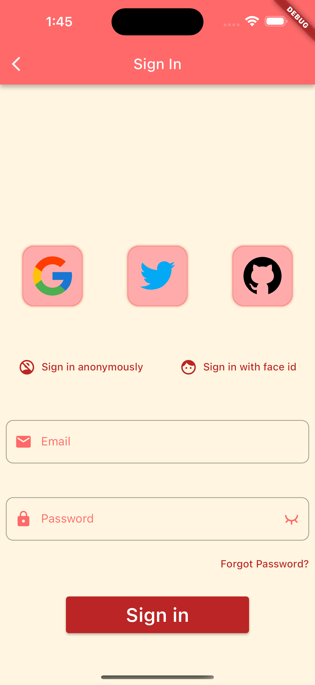
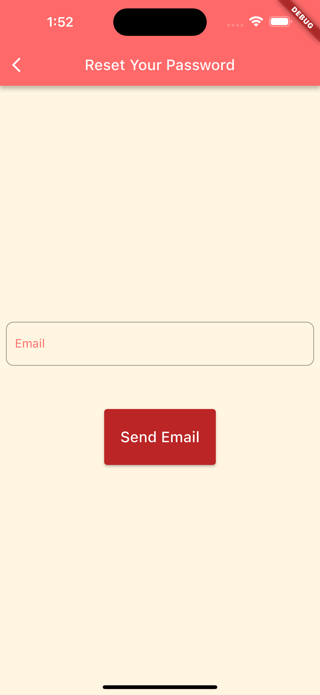
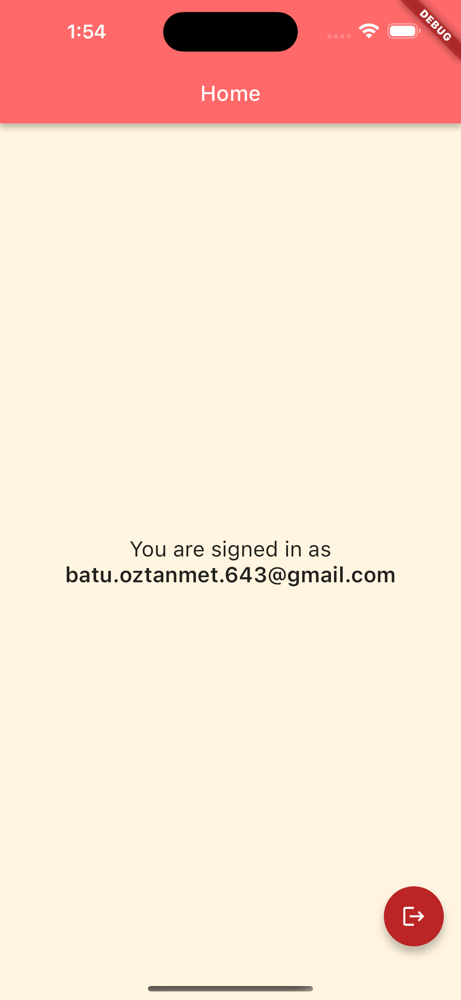

# Super Auth

Super Auth is a package for making authentication increadibly fast and easy for flutter applications. There are several functions for managing authentication with firebase and providers.

## Authentication Methods
* Sign up with **Email and Password**
* Sign in with **Email and Password**
* Sign in with **Google**
* Sign in with **Twitter**
* Sign in with **Github**
* Sign in **Anonymously**
* Sign in with **Face ID**

## Screens

#### Welcome Screen
Welcome Screen contains three buttons to navigate to different screens.

#### Sign Up Screen
Sign up contains two text fields and a button for signing up. Sign up button calls the signUp function from the auth service.

#### Sign In Screen
Sign in screen has a row of three buttons to sign in with third party providers. These are Google, Twitter, and Github respectively. Google button calls signInWithGoogle function, Twitter button calls signInWithTwitter function, Github button calls signInWithGithub function from the auth service. Below the provider buttons row, there is a row of two text buttons. These are sign in anonymously and sign in with face id button respectively. Sign in anonymously button calls signInAnon function and sign in with face id button calls signInWithFaceId function from the auth service. Below the text buttons row, there is the same text fields and button structure from the sign up screen, but in this case, the button calls signInWithEmailAndPassword function from the auth service. Also, there is a text button below the password field that says "Forgot Password?". This button navigates the user to the reset password scren.

##### Reset Password Screen
In the reset password screen, there is a text field for the email and a button for the sending the reset password email.

#### Home Page
Home page has a text for displaying logged in user's email. If user is signed in anonymously or with face id or OTP, home page displays a different text displaying the sign in method. This is because that face id and OTP are not synchronized with firebase so when user is signed in with these methods, firebase does not know that this user is signed in. Also, there is a floating action button for signing out.

